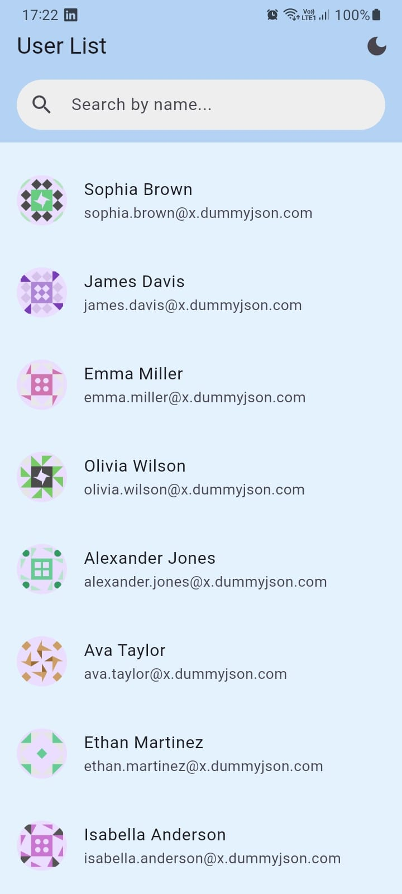
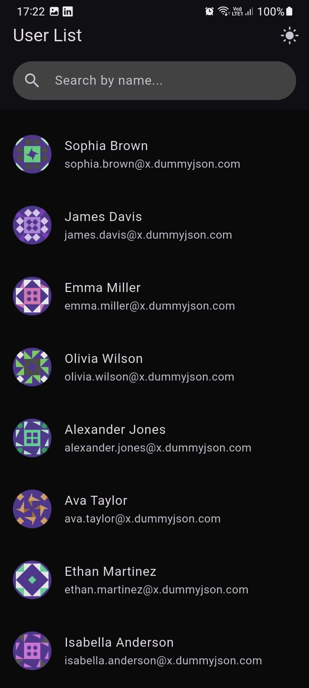
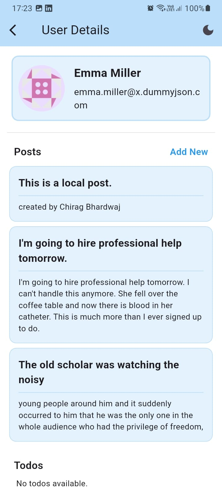
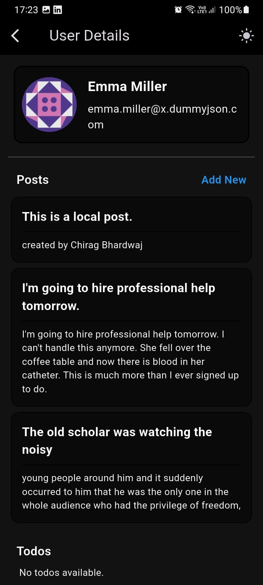
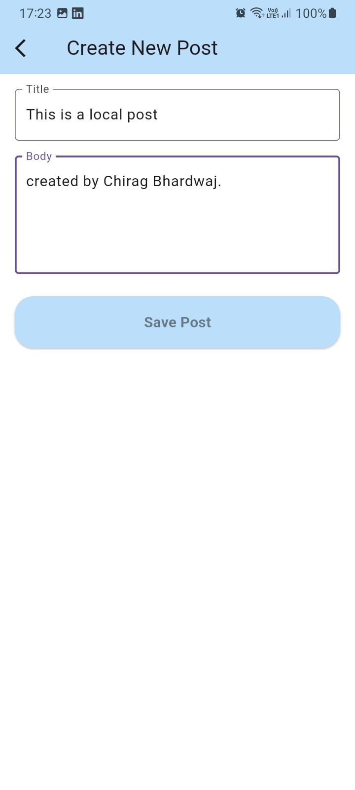

User Manager

A Flutter app that manages a list of users (from DummyJSON), supports search, infinite scrolling, pull-to-refresh with a custom warp-speed animation, dark/light theme toggle, user detail pages (with posts and todos), local “create post” functionality, and offline caching via Hive.

---

## 📋 Project Overview

This app fulfills all requirements of the Flutter Assessment Task:

- **API Integration**
  - Fetch users from DummyJSON Users API with pagination (`limit`/`skip`).
  - Search users by name.
  - Infinite scroll: load more users as you reach the bottom.
  - Fetch individual user’s posts (`/posts/user/{userId}`) and todos (`/todos/user/{userId}`).

- **BLoC State Management**
  - Used `flutter_bloc` to manage state for user list and user detail.
  - Separate events for fetching, searching, pagination, fetching user details, and adding a local post.
  - States reflect loading, success, and error.

- **UI Features**
  - **User List Screen**
    - Displays avatar, name, email.
    - Real-time search bar with debounce.
    - Infinite scrolling with a small bottom spinner.
    - Pull-to-refresh using a `WarpIndicator` with a warp-speed starfield animation.
    - Dark/light theme toggle in the app bar.
  - **User Detail Screen**
    - Shows full user info (avatar, name, email, phone).
    - Lists combined post list (remote + locally added).
    - Lists todos with a check icon for completed items.
    - Floating action button to open “Create Post” screen.
  - **Create Post Screen**
    - Simple form (title + body).
    - Adds a new post locally (appended to the top of the user’s post list).

- **Offline Caching (Hive)**
  - Cached users, posts, and todos in Hive.
  - On network failure, fall back to cached data so the app works offline.

- **Clean Architecture & Folder Structure**
  - Models & repository (domain layer)
  - BLoC (presentation/business logic)
  - UI widgets (screens + reusable components)
  - Dependency injection via `BlocProvider`

---

## ⚙️ Setup Instructions

1. **Clone the repository**
   ```bash
   git clone https://github.com/your_username/user_manager.git
   cd user_manager
   ```

2. **Install dependencies**
   ```bash
   flutter pub get
   ```

3. **Generate Hive Adapters**
   ```bash
   flutter pub run build_runner build --delete-conflicting-outputs
   ```

4. **Run the app**
   ```bash
   flutter run
   ```

5. **Build an APK**
   - Ensure Internet permission is added in `android/app/src/main/AndroidManifest.xml`:
     `<uses-permission android:name="android.permission.INTERNET"/>`
   - Then build:
     ```bash
     flutter build apk --release
     ```

6. **Offline Caching Initialization**
   - Hive is initialized automatically in `main.dart` and opens three boxes:
     - `usersBox` (type `User`)
     - `postsBox` (type `List<Post>` keyed by user)
     - `todosBox` (type `List<Todo>` keyed by user)

---

## 🏗️ Architecture Explanation

```
lib/
├── app/
│   ├ app_bloc_providers.dart    # Global BlocProviders (UserListBloc, ThemeCubit, etc.)
│   ├ app_router.dart            # GoRouter configuration
│   └ theme_cubit.dart           # Manages light/dark ThemeMode
│
├── features/
│   └ user_management/
│       ├── bloc/
│       │   ├ user_list_bloc.dart
│       │   ├ user_list_event.dart
│       │   ├ user_list_state.dart
│       │   ├ user_detail_bloc.dart
│       │   ├ user_detail_event.dart
│       │   └ user_detail_state.dart
│       │
│       ├── domain/
│       │   ├── models/
│       │   │   ├ user.dart       # HiveType–annotated model
│       │   │   ├ post.dart       # HiveType–annotated model
│       │   │   └ todo.dart       # HiveType–annotated model
│       │   └── repository/
│       │       └ user_repository.dart  # API calls + Hive caching
│       │
│       └── screens/
│           ├── user_list/
│           │   ├ user_list_screen.dart
│           │   └ widgets/
│           │       ├ user_tile.dart
│           │       └ warp_indicator.dart
│           │
│           ├── user_detail/
│           │   ├ user_detail_screen.dart
│           │   └ widgets/
│           │       ├ post_tile.dart
│           │       └ todo_tile.dart
│           │
│           └── create_post/
│               └ create_post_screen.dart
│
└── main.dart
```

---

## 🚀 Features Implemented

- ✅ API Integration:
  - Fetch users, pagination, search.
  - Fetch user posts & todos.
- ✅ BLoC State Management:
  - Separate events for fetch, search, pagination, user detail, and local post.
- ✅ User List Screen:
  - Avatar, name, email.
  - Real-time search with debounce.
  - Infinite scroll.
  - Custom “warp-speed” pull-to-refresh animation.
  - Dark/light theme toggle.
- ✅ User Detail Screen:
  - Displays user info, combined post list (remote + local), and todos.
  - FAB to create a new post locally.
- ✅ Create Post Screen:
  - Title + body form.
  - Adds a local post to top of user’s post list.
- ✅ Offline Caching (Hive):
  - Cached users, posts, and todos.
  - Fallback to Hive on network errors.
- ✅ Clean Architecture & Folder Structure
- ✅ Hive Adapters Generated via `build_runner`
- ✅ Internet Permission Declared

---

## 🖼️ Screenshots & GIFs

**User List Screen (Light Theme)**  


**User List Screen (Dark Theme)**  


**Pull-to-Refresh Warp Animation (Light & Dark)**  


**User Detail Screen (Remote & Local Posts, Light & Dark)**  
  


**Create Post Screen (Light & Dark)**  
  
<img src="assets/images/create_new_post_dark.jpeg" width="250" alt="Create Post Dark" /

---

## 🔍 How to Test

1. **Run on Simulator/Device**
   ```bash
   flutter run
   ```
2. **Search**: Type a name fragment (e.g. “Emily”) and wait 500 ms.
3. **Infinite Scroll**: Scroll to the bottom to load more users.
4. **Pull to Refresh**: Drag down to see the warp animation and refreshed data.
5. **User Details**: Tap a user to see details.
6. **Create Local Post**: Tap the “+” FAB to add a post; it appears at the top of the post list.
7. **Offline Mode**:
   - Turn off network.
   - Navigate around; cached data displays.

---

## 🔧 Dependencies

- **flutter_bloc**: State management (BLoC)
- **http**: API calls
- **equatable**: Value comparison for BLoC states/events
- **custom_refresh_indicator**: Custom pull-to-refresh animations
- **hive & hive_flutter**: Offline caching
- **path_provider**: Filesystem path for Hive
- **go_router**: Navigation
- **flutter_easyloading**: Three-bounce loading indicator
- **build_runner & hive_generator**: Generate Hive adapters

---

## 📝 License

This project is licensed under the MIT License. Feel free to fork and adapt for your own projects!

